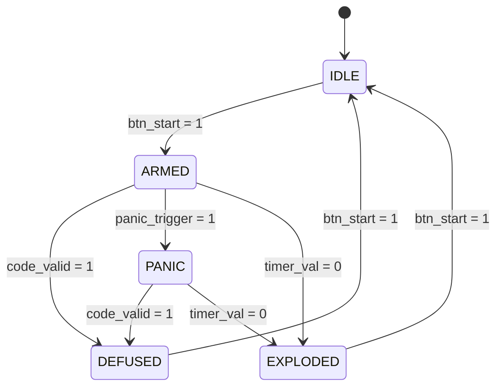
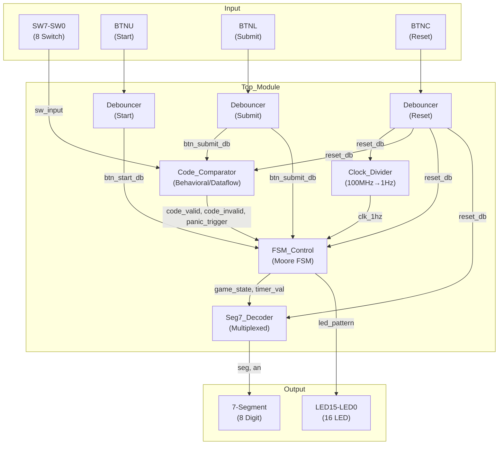

# Digital Bomb Defuse Game Berbasis FSM Moore pada FPGA Nexys A7-100T

## Dokumentasi Lengkap Tugas Akhir — Kelompok 22

---

## A. Penjelasan Program

### Konsep Permainan Bomb Defuse

Sistem ini merupakan simulasi permainan penjinak bom digital yang diimplementasikan pada FPGA Nexys A7-100T. Pemain harus memasukkan **kode rahasia 8-bit** menggunakan switch sebelum countdown timer habis. Jika kode benar, bom berhasil dijinakkan. Jika salah 3 kali atau waktu habis, bom "meledak".

### Cara Kerja Sistem

1. **IDLE** → Sistem standby, menunggu tombol START (BTNU)
2. **ARMED** → Timer 30 detik berjalan mundur. Pemain mengatur SW7-SW0 lalu tekan SUBMIT (BTNL)
3. **DEFUSED** → Kode benar! LED menampilkan pola sukses, timer berhenti
4. **EXPLODED** → Waktu habis atau panic. LED menampilkan pola ledakan
5. **PANIC** → 3x salah! Timer langsung loncat ke 5 detik, semua LED menyala

### Mekanisme Countdown
- Clock 100 MHz dibagi menjadi 1 Hz oleh `Clock_Divider` (counter 50 juta)
- Timer mulai dari **30 detik**, berkurang 1/detik saat ARMED
- Saat PANIC, timer langsung dipercepat ke **5 detik**

### Mekanisme Panic Countdown
- `Code_Comparator` menghitung setiap kode salah (error_count 0→3)
- Saat error_count = 3 → `panic_trigger` aktif
- FSM berpindah ke state PANIC → timer loncat ke 5 detik
- Semua 16 LED menyala sebagai indikator bahaya
- Pemain masih bisa mencoba kode benar untuk selamat!

### Alur Input & Output

| Komponen | Fungsi |
|----------|--------|
| SW7-SW0 | Input kode 8-bit pemain |
| BTNU | Start / Restart permainan |
| BTNL | Submit kode |
| BTNC | Reset sistem |
| LED15-LED0 | Indikator status (pola berbeda tiap state) |
| 7-Segment AN0-AN1 | Countdown timer (satuan & puluhan) |
| 7-Segment AN2-AN3 | Karakter status game (I/A/d/E/P) |

### Fungsi Setiap Modul

| Modul | Tipe | Fungsi |
|-------|------|--------|
| `Top_Module.v` | Coding Reuse | Penghubung & instantiasi semua submodule |
| `FSM_Control.v` | FSM Moore | Pengontrol state, timer, LED, logika permainan |
| `Code_Comparator.v` | Behavioral/Dataflow | Komparasi kode, error counting, panic trigger |
| `Clock_Divider.v` | Clocking | 100 MHz → 1 Hz untuk countdown |
| `Seg7_Decoder.v` | Display | Multiplexed 7-segment decoder |
| `Debouncer.v` | Input Processing | Eliminasi noise tombol mekanis (~10ms) |

---

## B. Desain Diagram FSM

### Diagram State (Deskriptif)

### Penjelasan Setiap State

| State | Encoding | Fungsi | Output LED | Timer |
|-------|----------|--------|------------|-------|
| **IDLE** | 3'b000 | Kondisi awal/reset. Menunggu START | `0000_0110_0110_0000` (4 LED tengah) | Reset ke 30 |
| **ARMED** | 3'b001 | Bom aktif, countdown berjalan | `0101_0101_0101_0101` (alternating) | Countdown 1/detik |
| **DEFUSED** | 3'b010 | Berhasil menjinakkan bom | `1000_0001_1000_0001` (LED tepi) | Berhenti |
| **EXPLODED** | 3'b011 | Gagal, bom meledak | `1010_1010_1010_1010` (alternating) | Tetap 0 |
| **PANIC** | 3'b100 | Darurat! 3x kesalahan | `1111_1111_1111_1111` (semua ON) | Loncat ke 5 detik |

### Kondisi Transisi

- **IDLE → ARMED**: Pemain menekan tombol START (BTNU)
- **ARMED → DEFUSED**: Kode yang di-submit cocok dengan kode rahasia
- **ARMED → PANIC**: Error count mencapai 3 (tiga kali salah)
- **ARMED → EXPLODED**: Timer countdown mencapai 0
- **PANIC → DEFUSED**: Pemain berhasil memasukkan kode benar di saat terakhir
- **PANIC → EXPLODED**: Timer countdown mencapai 0 setelah panic
- **DEFUSED → IDLE**: Pemain menekan START untuk bermain lagi
- **EXPLODED → IDLE**: Pemain menekan START untuk bermain lagi

---

## C. Tabel Kebenaran / State Transition Table

### FSM Moore — State Transition Table

| Current State | btn_start | code_valid | panic_trigger | timer_val=0 | Next State |
|--------------|-----------|------------|---------------|-------------|------------|
| IDLE | 0 | X | X | X | IDLE |
| IDLE | 1 | X | X | X | ARMED |
| ARMED | X | 1 | X | X | DEFUSED |
| ARMED | X | 0 | 1 | X | PANIC |
| ARMED | X | 0 | 0 | 1 | EXPLODED |
| ARMED | X | 0 | 0 | 0 | ARMED |
| PANIC | X | 1 | X | X | DEFUSED |
| PANIC | X | 0 | X | 1 | EXPLODED |
| PANIC | X | 0 | X | 0 | PANIC |
| DEFUSED | 1 | X | X | X | IDLE |
| DEFUSED | 0 | X | X | X | DEFUSED |
| EXPLODED | 1 | X | X | X | IDLE |
| EXPLODED | 0 | X | X | X | EXPLODED |

> **Catatan:** X = don't care. Prioritas transisi: code_valid > panic_trigger > timer=0.

### Moore Output Table (Output hanya bergantung pada Current State)

| Current State | LED[15:0] | game_active | Timer Action | 7-Seg Status |
|--------------|-----------|-------------|--------------|--------------|
| IDLE | `0x0660` | 0 | Reset→30 | "II" |
| ARMED | `0x5555` | 1 | Countdown | "AA" |
| PANIC | `0xFFFF` | 1 | Jump→5 | "PP" |
| DEFUSED | `0x8181` | 0 | Hold | "dd" |
| EXPLODED | `0xAAAA` | 0 | Show 0 | "EE" |

---

## D. Daftar File Kode Program Verilog

Semua file source berada di: `Tugas-Akhir_Kelompok-33.srcs/sources_1/new/`

| File | Deskripsi |
|------|-----------|
| [Top_Module.v](file:///c:/Users/howar/OneDrive/Documents/Matkul%20dan%20Praktikum/Praktikum%20SDL/Tugas%20Akhir/Tugas-Akhir_Kelompok-33/Tugas-Akhir_Kelompok-33.srcs/sources_1/new/Top_Module.v) | Top-level module, penghubung seluruh submodule |
| [FSM_Control.v](file:///c:/Users/howar/OneDrive/Documents/Matkul%20dan%20Praktikum/Praktikum%20SDL/Tugas%20Akhir/Tugas-Akhir_Kelompok-33/Tugas-Akhir_Kelompok-33.srcs/sources_1/new/FSM_Control.v) | FSM Moore controller (5 state) |
| [Code_Comparator.v](file:///c:/Users/howar/OneDrive/Documents/Matkul%20dan%20Praktikum/Praktikum%20SDL/Tugas%20Akhir/Tugas-Akhir_Kelompok-33/Tugas-Akhir_Kelompok-33.srcs/sources_1/new/Code_Comparator.v) | Behavioral/dataflow code comparison & error counting |
| [Clock_Divider.v](file:///c:/Users/howar/OneDrive/Documents/Matkul%20dan%20Praktikum/Praktikum%20SDL/Tugas%20Akhir/Tugas-Akhir_Kelompok-33/Tugas-Akhir_Kelompok-33.srcs/sources_1/new/Clock_Divider.v) | 100 MHz → 1 Hz clock divider |
| [Seg7_Decoder.v](file:///c:/Users/howar/OneDrive/Documents/Matkul%20dan%20Praktikum/Praktikum%20SDL/Tugas%20Akhir/Tugas-Akhir_Kelompok-33/Tugas-Akhir_Kelompok-33.srcs/sources_1/new/Seg7_Decoder.v) | 7-segment multiplexed decoder |
| [Debouncer.v](file:///c:/Users/howar/OneDrive/Documents/Matkul%20dan%20Praktikum/Praktikum%20SDL/Tugas%20Akhir/Tugas-Akhir_Kelompok-33/Tugas-Akhir_Kelompok-33.srcs/sources_1/new/Debouncer.v) | Button debouncing (~10ms) |

**Testbench:** `Tugas-Akhir_Kelompok-33.srcs/sim_1/new/`

| File | Deskripsi |
|------|-----------|
| [TB_Top_Module.v](file:///c:/Users/howar/OneDrive/Documents/Matkul%20dan%20Praktikum/Praktikum%20SDL/Tugas%20Akhir/Tugas-Akhir_Kelompok-33/Tugas-Akhir_Kelompok-33.srcs/sim_1/new/TB_Top_Module.v) | Testbench dengan 5 skenario pengujian |

**Constraint:** `Tugas-Akhir_Kelompok-33.srcs/constrs_1/new/`

| File | Deskripsi |
|------|-----------|
| [Nexys_A7_100T.xdc](file:///c:/Users/howar/OneDrive/Documents/Matkul%20dan%20Praktikum/Praktikum%20SDL/Tugas%20Akhir/Tugas-Akhir_Kelompok-33/Tugas-Akhir_Kelompok-33.srcs/constrs_1/new/Nexys_A7_100T.xdc) | Pin constraint lengkap Nexys A7-100T |

---

## E. Diagram Blok Sistem

---

## F. Skenario Pengujian

### Skenario 1: Reset & Inisialisasi
1. Tekan BTNC → Sistem masuk IDLE
2. **Verifikasi:** Timer = 30, LED = `0x0660`, 7-seg = "II 30"

### Skenario 2: Start Game
1. Tekan BTNU → Masuk ARMED
2. **Verifikasi:** Timer countdown dari 30, LED = `0x5555`, 7-seg = "AA 30→29→28..."

### Skenario 3: Kode Benar → DEFUSED
1. Atur SW = `10100101` (0xA5)
2. Tekan BTNL (submit)
3. **Verifikasi:** State = DEFUSED, LED = `0x8181`, timer berhenti

### Skenario 4: 3x Salah → PANIC → EXPLODED
1. Submit kode salah 3 kali
2. **Verifikasi:** Error count naik 1→2→3
3. State → PANIC, timer loncat ke 5 detik, semua LED ON
4. Tunggu timer habis → EXPLODED, LED = `0xAAAA`

### Skenario 5: PANIC lalu DEFUSED (Penyelamatan!)
1. Setelah PANIC, masukkan kode benar sebelum timer habis
2. **Verifikasi:** State langsung ke DEFUSED

---

## G. Analisis Kelebihan dan Kekurangan

### Kelebihan
- ✅ FSM Moore murni (output hanya dari current_state)
- ✅ Modular: 6 modul independen, mudah di-maintain
- ✅ Debouncing hardware untuk input reliable
- ✅ Panic countdown menambah kompleksitas gameplay
- ✅ Fully synthesizable, tanpa `#delay`
- ✅ Pin constraint akurat untuk Nexys A7-100T

### Kekurangan
- ❌ Kode rahasia hardcoded (bisa ditambah randomizer)
- ❌ Tidak ada buzzer/audio output
- ❌ Display hanya 4 dari 8 digit 7-segment
- ❌ Bisa ditambah level difficulty progression

---

> [!IMPORTANT]
> **Kode rahasia default:** `10100101` (0xA5). Ubah parameter `SECRET_CODE` di `Top_Module.v` untuk mengganti.

> [!TIP]
> Untuk menambahkan file ke Vivado project: **Add Sources → Add or Create Design Sources → pilih semua .v file dari `sources_1/new/`**. Lakukan hal sama untuk constraint (.xdc) dan simulation source (testbench).
